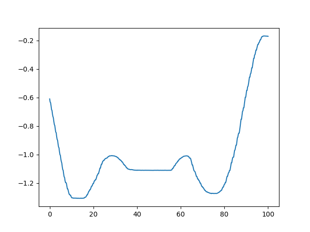
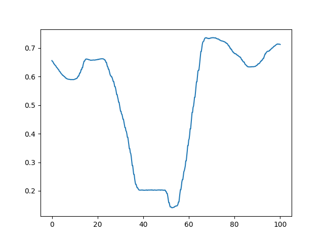
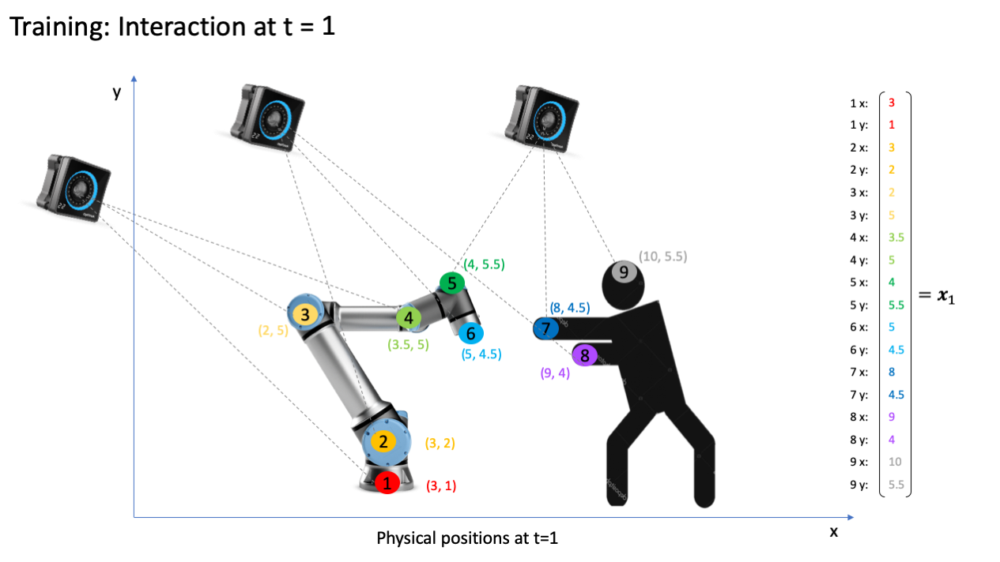
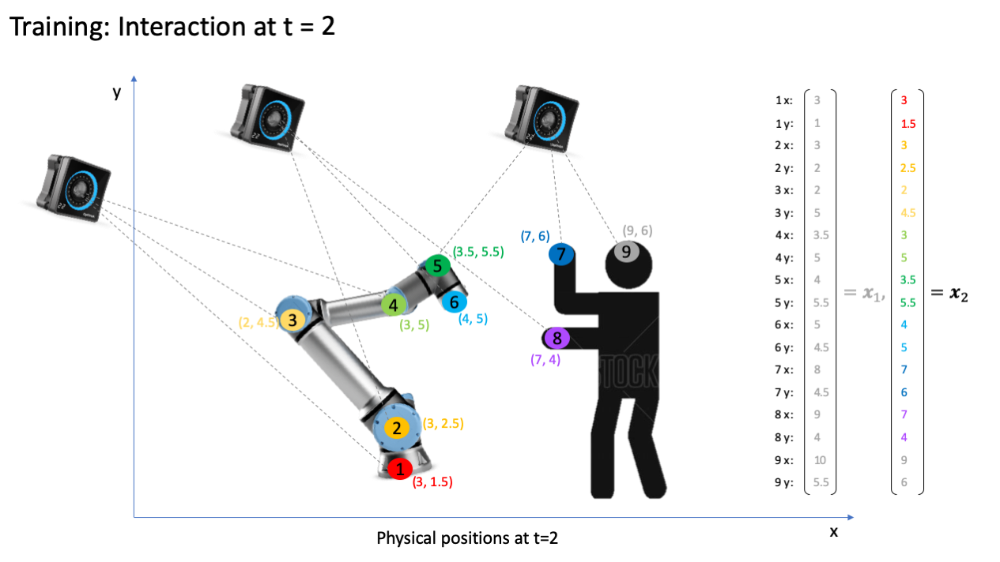
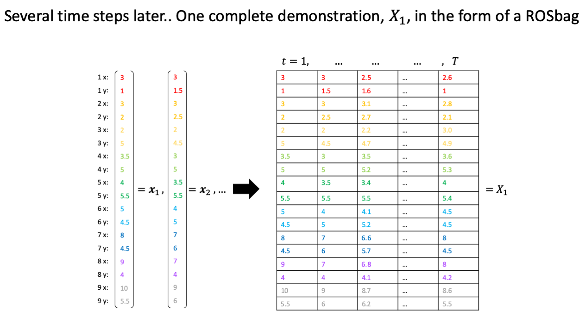
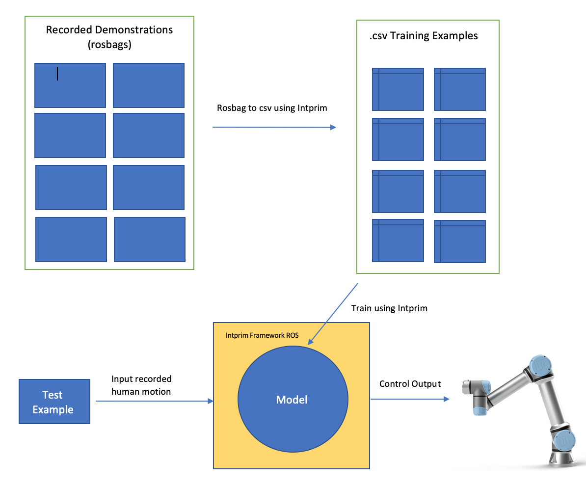

# Introduction to IntPrim ROS Framework
In this section, we will discuss the applications of IntPrim ROS Framework and how it can be used for Human-Robot interaction, Robot-Robot interaction, or even Human-Human interaction. Robot-Robot interactions can be done using [CoppeliaSim](3_robot_example.md) or in-person.

# **1.0 Applications**
## Context 1: Human-Robot
In this example of Joe lifting a box in collaboration with the UR5 robot, there are two parties involved. In order to train this particular model, Intprim requires rosbags (recorded demonstrations) from Human-Robot interactions. Additionally, it is possible to capture Human-Human interactions using Intprim. The collection process is discussed at a high level [below](#30-collecting-data-with-intprim-ros-framework), and is also implemented in the [CoppeliaSim Robot Example](3_robot_example.md) tutorial. Most importantly, the framework is agnostic to the type of partner (robot or human) and only requires the trajectories to be captured.

<p align="center">
  
</p>

## Context 2: Robot-Robot
In this example of robots interacting inside of CoppeliaSim, there are two parties involved again. For this particular scenario, Intprim uses recordings of the robots that are obtained through state information from CoppeliaSim (training examples). During training, the generated trajectories for robots are created by the individual user by applying inverse/forward kinematics and adding random noise, or by using any method that captures the desired interaction between two robots. Most importantly, it is up to the user to decide which kind of motion planner they would like to implement for the robot-robot interactions. See the full [tutorial](3_robot_example.md) for more details.

<p align="center">
  
  
  
</p>

# **2.0 Example Trajectories**
Here are some example trajectories of a Human-Robot interaction, which are extracted and plotted for visualization purposes... <br><br> Example Trajectory for a Human during Interaction (ex: Human's DOFs start at 0):

```python
import pandas as pd
import numpy as np
import matplotlib.pyplot as plt
df = pd.read_csv("interaction.csv")
plt.plot(np.linspace(0,100,df.shape[0]), df.iloc[:,0])
plt.show()
```



Example Trajectory for a Robot during interaction (ex: Robot's DOFs start at index 10):

```python
df = pd.read_csv("interaction.csv")
plt.plot(np.linspace(0,100,df.shape[0]), df.iloc[:,10])
plt.show()
```


Since the data in the csv file defines the interaction trajectories over time, these files are the only information needed for Intprim to work. As stated above, users have the ability to either generate these trajectories with Robot-Robot interactions or through Human-Robot interactions, while Human-Human interactions is also a possibility. This particular csv file contains the information from a recorded demonstration that was used to train the Intprim model.

# **3.0 Collecting Data with Intprim ROS Framework**
To get started, you will need to conduct experiments consisting of two parties interacting. These recorded experiments will be used to train the Bayesian Interaction Primitives model. We expect that both parties' DOFs will be published as a rostopic during the interaction. During the demonstration, Intprim will record the interaction and save it as a rosbag. Here is an example of a simple interaction below:


At t = 1, the degrees of freedom for the robot and human partner are captured as a column vector. Because every DOF is published as a ROS topic that is time stamped, this information can be easily recorded and extracted. In the diagram above, the coordinates for each DOF are recorded; however, in practice, we record the joint angles of the robot. The key takeaway is all DOFs are treated equally and may be in different units (radians, centimeters).


At t = 2, the degrees of freedom for the robot and human partner are captured as a column vector again. Notice how the subject and robot are in slightly different poses, which is captured by x2. These time steps define the points along the trajectory, so the vectors will be concatenated into matrix form.


Once the interaction is complete, the trajectories and recorded data will be stored in a rosbag. Since the rosbag includes time-stamped data, it can be viewed as a matrix (with every column representing a time slice). The above diagrams demonstrate the general idea of collecting data as rosbags, which are then converted to csv files and used to train a model. The IntPrim ROS framework makes it easy to add new devices, collect data, and perform different types of interactions with different types of partners. The following diagram (below) represents the overall workflow and additional steps required to train/test an interaction:


So far we have discussed collecting data (from both parties) as rosbags at a high level. The above diagram depicts the next steps and general execution flow for using IntPrim. The following tutorials will demonstrate how to convert rosbags to csv format, train a model using the Interactive Application CLI, and run tests for inference.
