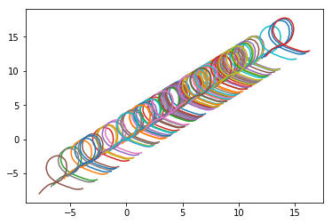

# Minimal Example - Handwritten Interaction
This tutorial will walk through an example to train and test pre-generated csvs of handwritten shapes, which can represent arbitrary DOF trajectories from from an interaction. The purpose of this tutorial is- for your convenience- to get started with the IntPrim ROS framework right away, without having to collect demonstration data. In this tutorial, a single interaction consists of an x and y trajectory over time. Although a physical interaction didn't generate this data, we can imagine the following... During an actual experiment, several rosbags would be collected to capture the nature of the interaction using the [Interactive Application CLI (collect rosbags)](sub_tutorials/interactive_application_cli.md#collect-rosbags-during-training). Then, the rosbags will be converted to csv files using the [Interactive Application CLI (convert rosbags)](sub_tutorials/interactive_application_cli.md#convert-rosbags-to-csv-files). Included in the [handwritten](tutorial_examples/handwritten/csvs) folder are 100 csv files generated from the "handwritten" experiment during training phase, each representing one interaction. These csv files can be used to train a model, and hence learn, this interaction. Below is an example handwritten figures, which are captured in the csv files:

  

## **1.0 Getting Started**
The typical steps that are necessary for running a new experiment include: writing a robot driver, [creating new device(s)](4_creating_new_device.md) within the framework, and [creating the yaml experiment files](5_creating_new_experiment.md). However, these steps have already been completed for this tutorial. The [simulated robot example](3_robot_example.md) tutorial covers these steps in sequential order, providing more insight into the process, if you are interested in creating your own experiment. Additionally, you can check out the source code for the  [devices](../../include/intprim_framework_ros/devices) and [parameter files](../../param) that are used for this particular experiment. In the next section, we will simply modify the local directory paths in the parameter files, but we will not modify anything else. Overall, the purpose of omitting these aforementioned steps from the tutorial is twofold: 

1. Normally, a user will collect recorded demonstrations using their personal robots and sensors. In order to train a model on these demonstrations, the framework must map column indices from the csv file to the correct DOFs of the devices that were used to generate the data. For example, column one must correspond to the x position of the given DOF over time. This is because during the interaction, the x position of this DOF was stored in column 1. Consequently, the correct parameter files must be loaded during model training because they contain information about the indexing order of the csv file- hence the reason we provide both csv files and parameters. **Important:** As a result of having two different tutorials/interactions within the same parameter files (instead of creating separate launch files), you must ensure:
   * The correct interaction is selected from the Interactive Application GUI drop-down list when [training a model](sub_tutorials/interactive_application_cli.md#train-model-from-csv-files), or else the indices of the csv file will not match up.
   * When the Interaction Application CLI is launched, it loads the interaction that contains the `primary: true` parameter inside of the `intprim_param.yaml` file; all other interactions inside of this file must be set to `primary: false`.

2. This tutorial focuses on training a model and performing inference on the trained model, rather than the setup required to do so.

## **1.1 Setting up Experiment** - Adjusting the parameter files
As mentioned above, you do not have to create the parameter files since they are already included. However, you must modify the local file paths so that the model is saved in your desired output directory. The [create new experiment](5_creating_new_experiment.md) tutorial can be used for reference and contains definitions for all of the parameters. Inside [intprim_param.yaml](../../param/intprim_param.yaml), there are two interaction id's. This tutorial for the handwritten figures uses the first entry (id=0; name="Simple Example"); the tutorial for CoppeliaSim uses the second entry (id=1; name="CoppeliaSim"). You will need to change the following paths **in the first interaction (id=0)** to real existing paths:

* import_data: "\<path\>/trained_bip.bip"
* observation_noise: "\<path\>/observation_noise.noise"
* mip_test_directory: "\<path\>"
* debug_directory: "\<path\>/debug"
* primary: true
    
1. Change top two paths to the desired directories on your computer (or docker container / VM envrionment paths if running virtually) and choose file names for the .noise and .bip files. These files represent the underlying "BIP model".
2. The `mip_test_directory` should be the location of the [training samples](tutorial_examples/handwritten/csvs) folder on your computer.
3. The `debug_directory` is used for debugging IntPrim, which is beyond the scope of this tutorial. You can set that to any arbitrary directory for now.
4. **IMPORTANT:** the `primary` parameter is used to indicate which interaction parameters get loaded when the Interactive Application CLI starts up. Make sure `primary: true` is set for id=0 when running this tutorial, and `primary: false` is set for id=1 since we do not want to load the parameters for the CoppeliaSim tutorial.

## **1.2 Training** - Training model from csv files

1. Follow the instructions for the [Train model from csv files](sub_tutorials/interactive_application_cli.md#train-model-from-csv-files) section in the Interactive Application CLI reference, which covers the general steps for training a model from csv files. **NOTE**: The CLI for this tutorial can be launched by running `roslaunch intprim_framework_ros interaction_application.launch`. Make sure to select the default `Simple Experiment` from the list of experiments and use a subset of the [training csv files](tutorial_examples/handwritten/csvs). We will save some csvs for testing for the next step.

## **1.3 Testing** - Testing model from csv files
1. In the next step, you will need to specify the folder for the test set. When prompted by the CLI, you can choose the default location or manually enter the path to your [test set](tutorial_examples/handwritten/csvs) folder (use a subset of the training folder). To configure the default directory, modify the `default_playback_dir` parameter inside of [interaction.yaml](../../param/interaction.yaml) to reflect the path of your test set folder. If `default_playback_dir` is set, it will need to be changed for the CoppeliaSim tutorial, since both tutorials use the parameters inside of `interaction.yaml`.

2. If not already launched, launch the Interactive Application CLI again by running the following command in a terminal:
`roslaunch intprim_framework_ros interaction_application.launch`

3. Follow the instructions for the [Test model from csv files](sub_tutorials/interactive_application_cli.md#test-model-from-csv-files)

4. See the below section (1.4) for the expected output.

## **1.4 Expected Results** - Testing output

You should now see the MSE related to your testing csvs that are run against the trained model. The magnitude of the MSE is one metric we can use to evaluate how well model predicts the interaction. Play around with different parameter settings, the sizes of the test/train subsets, and filtering settings to see how they affect the MSE.
